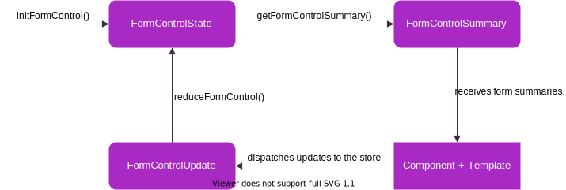

This framework takes an opinionated approach to managing forms. Following goals were set while composing this framework:

-   The complete state of a form should be leveraged to be in one central place (NgRx store).
-   The state of a form should be as minimal as possible. Every value that can be calculated from the minimal values of the state is not in the state, but instead retrieved in an abstraction function (selector). A prime example for this are errors, which are based on validators.
-   The state of a form can be manipulated in any way, as the values in it do **not** depend on each other. Updates can be applied manually or with functions provided by the framework.
-   The whole data flow (actions + selectors) between the form state and the actual form should be manually set by the user. **No magic.**
-   Types are available at every point of interaction with the form.

While all of these goals were met during the implementation of this framework, it comes at the same cost as NgRx. The necessary boilerplate code in comparison to Reactive Forms is significantly larger.

[Example application](https://example.ngrx-clean-forms.surge.sh).

## Installation

```
npm i ngrx-clean-forms
```

## Module import

To use the directives of this framework the import of the module is necessary. It is **not** necessary to import any other form modules (e.g. `ReactiveFormsModule` or `FormsModule`).

```typescript
import { NgrxCleanFormsModule } from 'ngrx-clean-forms';

@NgModule({
    imports: [
        NgrxCleanFormsModule,
        ..
    ],
    ...
})
export class AppModule {}
```

## Data flow

The following graphic displays the data flow for a single control in ngrx-clean-forms. The data flow of form groups and arrays is analogous.


