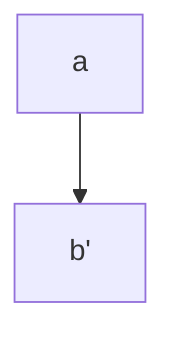

## Installation

```
npm i ngrx-clean-forms
```

## Module import

To use the directives of this framework the import of the module is necessary. It is **not** necessary to import any other form modules (e.g. `ReactiveFormsModule` or `FormsModule`).

```typescript
import { NgrxCleanFormsModule } from 'ngrx-clean-forms';

@NgModule({
    imports: [
        NgrxCleanFormsModule,
        ..
    ],
    ...
})
export class AppModule {}
```

## Data flow


